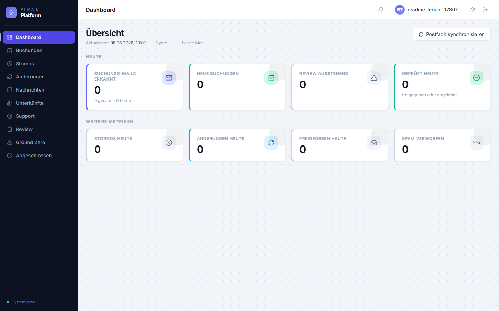
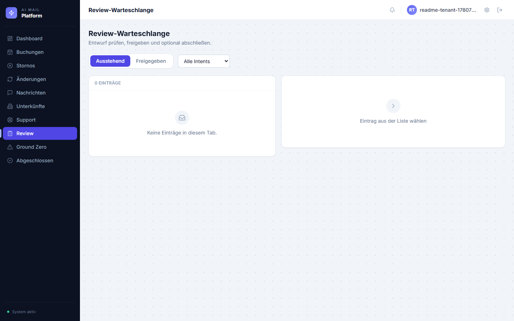
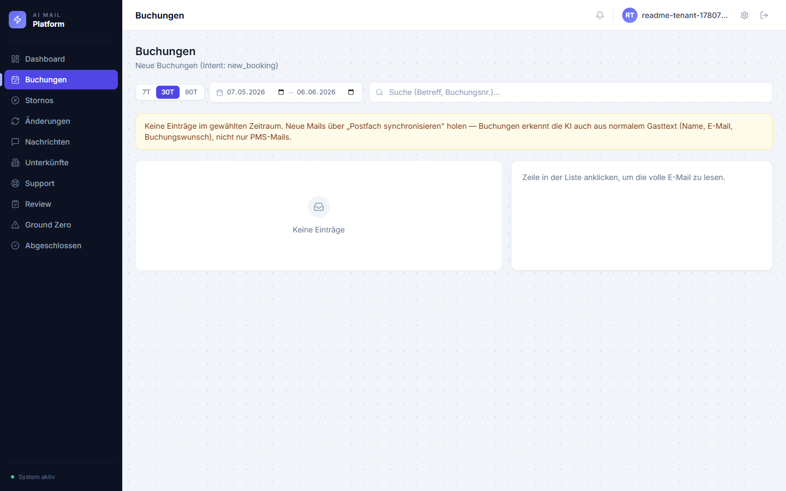
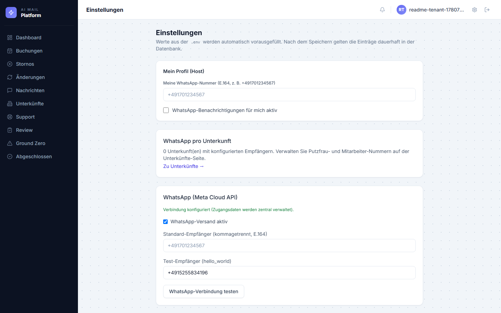
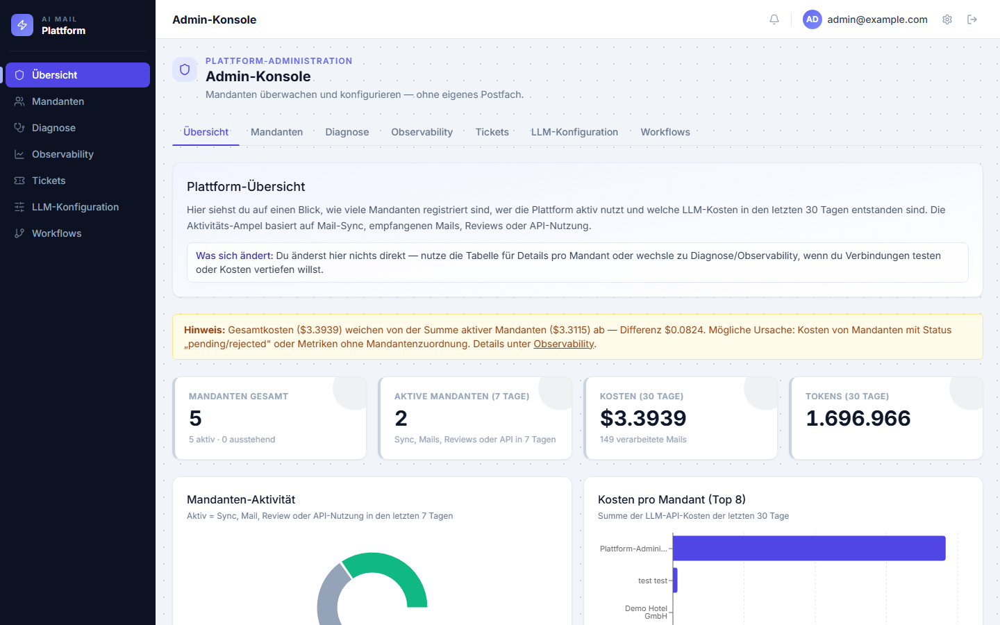
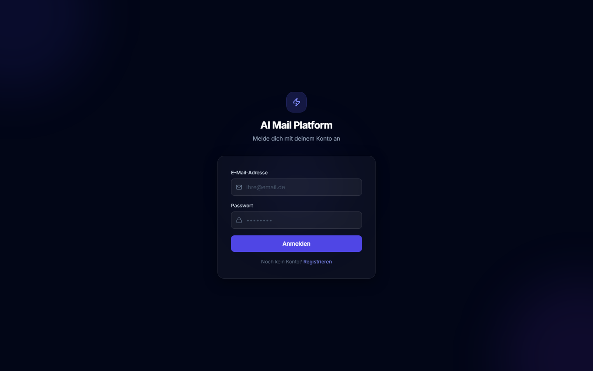
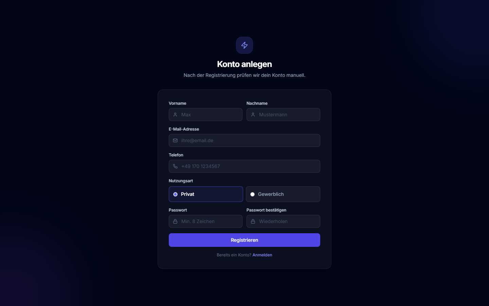

# Booking E-Mail Plattform

KI-gestützte Verarbeitung eingehender Buchungs-E-Mails mit menschlicher Freigabe — kein automatischer Versand. Entwickelt für Ferienwohnungs-Vermieter (Airbnb, Booking.com, Expedia, VRBO, Direktbuchung).

**Live:** [booking-email-checl-production.up.railway.app](https://booking-email-checl-production.up.railway.app)

---

## Was die Plattform macht

| Feature | Beschreibung |
|---|---|
| **Mail-Polling** | Holt automatisch alle 5 Min neue Mails via IMAP oder Microsoft Outlook |
| **KI-Pipeline** | Klassifiziert, extrahiert Buchungsdaten, erstellt Antwortentwurf |
| **Review-Queue** | Entwürfe warten auf menschliche Freigabe — **kein Auto-Versand** |
| **WhatsApp-Alerts** | Benachrichtigt Host + Reinigungsteam per WhatsApp bei neuen Buchungen |
| **WhatsApp-Webhook** | Antworten vom Reinigungsteam werden automatisch an den Host weitergeleitet |
| **Multi-Tenant** | Mehrere Vermieter-Accounts mit vollständiger Datentrennung |
| **Onboarding** | Self-Service Postfach-Einrichtung (IMAP oder Outlook OAuth) |

---

## Dashboard (UI)

Das React-Dashboard bündelt Mandanten- und Plattform-Ansichten: KPIs, Mail-Listen,
Human Review und Admin-Konsole.

| Ansicht | Screenshot |
|---------|------------|
| Mandanten-Dashboard (KPIs, Sync) |  |
| Review-Warteschlange (Entwurf prüfen) |  |
| Buchungsliste (Intent-Filter) |  |
| Einstellungen (WhatsApp, Postfach) |  |
| Plattform-Admin (Mandanten & Kosten) |  |
| Login & Registrierung |  ·  |

Screenshots neu erzeugen:

```powershell
# Production (Railway) – ADMIN_EMAIL / ADMIN_PASSWORD aus .env;
# optional TENANT_EMAIL / TENANT_PASSWORD für Mandanten-Ansichten
cd frontend
npm run screenshots:production

# Lokal mit Demo-Daten (ohne Atlas):
# Terminal 1: .\.venv\Scripts\python scripts\screenshot_demo_server.py
# Terminal 2: cd frontend && npm run screenshots:demo
```

---

## Tech-Stack

| Bereich | Technologie |
|---|---|
| Backend | Python 3.11, Flask, LangGraph, Pydantic |
| KI | OpenAI GPT-4o-mini (Klassifikation, Extraktion, Entwurf) |
| Datenbank | MongoDB Atlas (Dokumente + Vektor-Suche) |
| Observability | Langfuse |
| Frontend | React 18, TypeScript, Vite, Tailwind CSS |
| Deployment | Railway, Docker, Gunicorn, GitHub Actions CI |
| Notifications | Meta WhatsApp Cloud API |

---

## Architektur

```
backend/
├── api/            # Flask Blueprints, JWT Auth, Rate Limiting
├── ai/             # LangGraph Workflow, LLM-Services, Prompts, Domänen-Packs
├── features/       # Mail-Polling, WhatsApp-Notifications, Platform-Admin
├── infrastructure/ # MongoDB Repositories, Outlook Graph Adapter
├── core/           # Config, Pydantic Models, Utils
└── application/    # Ingestion & Review Ports

frontend/src/
├── features/       # Screens (Dashboard, Emails, Review, Settings, Onboarding)
├── shared/         # UI-Komponenten, Layout
└── lib/            # API-Clients, TypeScript Types
```

Import-Richtung strikt von oben nach unten: `api → features → ai → infrastructure → core`. Max. 300 Zeilen pro Datei (CI-enforced).

---

## Lokale Entwicklung

**Voraussetzungen:** Python 3.11, Node.js 20, MongoDB Atlas, OpenAI API Key, Langfuse

```bash
# Backend
python3.11 -m venv .venv && .venv\Scripts\activate   # Windows
pip install -e ".[dev]"
pre-commit install && pre-commit install --hook-type commit-msg
cp .env.example .env   # API Keys eintragen

# Admin-Account anlegen + Backend starten
python scripts/seed_admin.py
flask --app backend.api.app:create_app run --debug --port 5000

# Frontend (zweites Terminal)
cd frontend && npm install && npm run dev
```

Browser: `http://localhost:5173`

---

## Deployment (Railway)

Push auf `main` löst automatisch einen Deploy aus.

**Pflicht-Variablen in Railway:**

```
OPENAI_API_KEY          OpenAI API Key
MONGODB_URI             Atlas Connection String
FLASK_SECRET_KEY        openssl rand -hex 32
ADMIN_EMAIL             Admin Login
ADMIN_PASSWORD          Admin Passwort
LANGFUSE_PUBLIC_KEY     Langfuse Key
LANGFUSE_SECRET_KEY     Langfuse Secret
APP_ENV                 production
FLASK_ENV               production
CORS_ORIGINS            https://booking-email-checl-production.up.railway.app
```

**Optionale Variablen:**

```
WHATSAPP_ENABLED                true
WHATSAPP_ACCESS_TOKEN           Meta System-User Token (dauerhaft)
WHATSAPP_PHONE_NUMBER_ID        Meta Phone Number ID
WHATSAPP_WEBHOOK_VERIFY_TOKEN   Eigener geheimer String für Webhook-Verifikation
AZURE_CLIENT_ID                 Für Outlook OAuth
AZURE_CLIENT_SECRET             Für Outlook OAuth
OUTLOOK_OAUTH_REDIRECT_URI      https://…/api/mail/outlook/callback
```

**Einmalig nach erstem Deploy:**
```bash
railway run python scripts/seed_admin.py
```

---

## WhatsApp-Webhook einrichten

Damit Antworten vom Reinigungsteam automatisch an den Host weitergeleitet werden:

1. [Meta Developer Portal](https://developers.facebook.com) → App → WhatsApp → Configuration
2. Callback-URL: `https://booking-email-checl-production.up.railway.app/api/whatsapp/webhook`
3. Verifizierungstoken: gleicher Wert wie `WHATSAPP_WEBHOOK_VERIFY_TOKEN` in Railway
4. Webhook-Feld **`messages`** abonnieren

---

## Tests & Qualität

```bash
pytest -q                              # alle Unit-Tests
pytest -m integration                  # benötigt MONGODB_URI
python scripts/check_max_file_lines.py # 300-Zeilen-Limit
ruff check . && black --check . && mypy .
```

CI läuft bei jedem Push: Ruff, Black, MyPy, Pytest, TypeScript-Build.

---

## Dokumentation

| Datei | Inhalt |
|---|---|
| [`docs/ARCHITECTURE.md`](docs/ARCHITECTURE.md) | Schichten, Import-Regeln, Entrypoints |
| [`docs/SPEC.md`](docs/SPEC.md) | Fachliche Spezifikation |
| [`docs/OUTLOOK.md`](docs/OUTLOOK.md) | Microsoft Graph / OAuth Setup |
| [`docs/LANGFUSE.md`](docs/LANGFUSE.md) | Tracing und Observability |
| [`docs/GEMINI.md`](docs/GEMINI.md) | Gemini Multimodal (Workflow-Sandbox) |
| [`docs/ROADMAP.md`](docs/ROADMAP.md) | Geplante Features |
| [`docs/USER_SETUP.md`](docs/USER_SETUP.md) | Nutzer-Onboarding-Guide |
| [`docs/images/`](docs/images/) | Architektur-Diagramme und UI-Screenshots |
| [`CLAUDE.md`](CLAUDE.md) | Projektregeln für KI-Agenten |

---

## Sicherheit

- Keine Secrets im Repository — ausschließlich über Umgebungsvariablen
- PII wird vor Langfuse-Traces maskiert (`backend/core/utils/pii_mask.py`)
- Kein automatischer E-Mail-Versand — jeder Entwurf erfordert menschliche Freigabe
- Alle API-Endpoints sind JWT-geschützt mit Account-Scope-Prüfung
