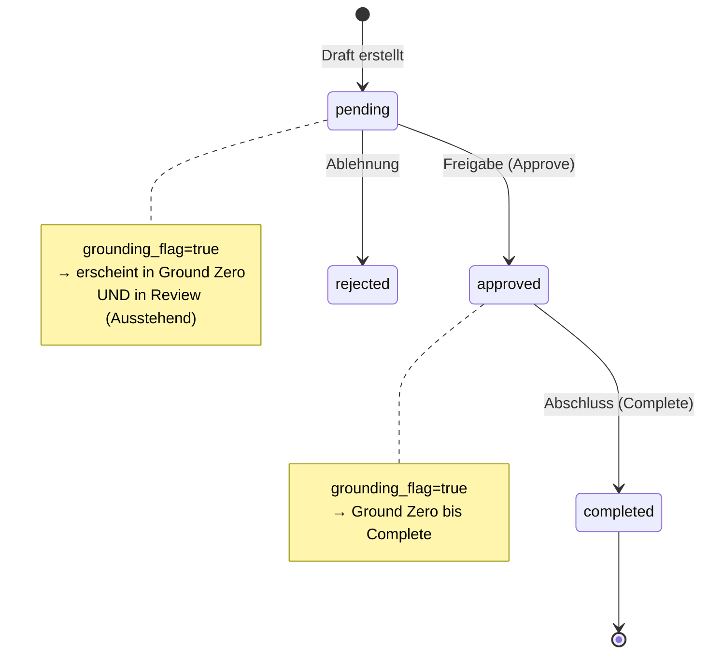

# Roadmap — geplante Features (für Agenten & Planung)

Dieses Dokument ergänzt `docs/SPEC.md` und `docs/AGENTS.md` um **noch nicht implementierte** Features.
Agenten: vor Umsetzung eines Punkts hier Spec lesen, kleinste PR-Schnitte planen, Conventional Commits.

**Status-Legende:** `[ ]` offen · `[~]` in Arbeit · `[x]` erledigt

---

## Phase 6 — Support-Tickets (Mandant → Plattform-Admin)

**Ziel:** Mandanten-User können dem Plattform-Betreiber direkt eine Nachricht schicken („Ticket“).
Der Admin sieht alle Tickets in einer Übersicht (User, Dringlichkeit, Text, Status).
Bei jedem neuen Ticket wird der Admin per **WhatsApp-Template** an die beim Admin hinterlegte Nummer benachrichtigt.

> **Abgrenzung:** Kein E-Mail-Versand, kein LLM-Pflichtfeld. Tickets sind Ops/Support, nicht Buchungs-Mail-Workflow.
> Bestehende WhatsApp-Templates für Buchungen (`booking_*`) bleiben unverändert; neues Template nur für Admin-Alerts.

---

### 6.1 Produkt & Rollen

| Rolle | Darf |
|-------|------|
| Mandant (`owner`, `admin` des Accounts) | Ticket erstellen, eigene Tickets lesen |
| Mandant (`member` o.ä., falls vorhanden) | Ticket erstellen (optional einschränken — festlegen in Implementierung) |
| `platform_admin` | Alle Tickets lesen, Status ändern, filtern/sortieren |
| Gast / nicht eingeloggt | Kein Zugriff |

- [x] Ticket-Formular in Mandanten-UI (z. B. unter **Einstellungen** oder eigener Nav-Punkt „Support”)
- [x] Admin-Übersicht unter `/admin/tickets` (Sidebar-Eintrag neben Diagnose/Observability)
- [x] Keine PII aus Mail-Inhalten in Ticket-Text vorausfüllen (User tippt selbst; Injection-Hinweis wie bei Mails)

---

### 6.2 Datenmodell (MongoDB)

**Collection:** `support_tickets` (tenant-scoped + Admin-querbar)

| Feld | Typ | Pflicht | Beschreibung |
|------|-----|---------|--------------|
| `_id` | ObjectId | ja | |
| `ticket_id` | string (UUID) | ja | Öffentliche ID für API/Deep-Link |
| `account_id` | string | ja | Mandant |
| `created_by_user_id` | string | ja | Ersteller |
| `created_by_email` | string | ja | Anzeige für Admin (denormalisiert) |
| `subject` | string | nein | Kurztitel (max. z. B. 120 Zeichen) |
| `message` | string | ja | Nutzernachricht (max. z. B. 4000 Zeichen) |
| `urgency` | enum | ja | `low` \| `normal` \| `high` \| `critical` |
| `status` | enum | ja | `open` \| `in_progress` \| `resolved` \| `closed` (Default: `open`) |
| `admin_note` | string | nein | Interner Admin-Kommentar |
| `whatsapp_notify_status` | enum | ja | `pending` \| `sent` \| `failed` \| `skipped` |
| `whatsapp_notify_error` | string | nein | Letzter Fehler (kein Token loggen) |
| `whatsapp_message_id` | string | nein | Provider-ID bei Erfolg |
| `created_at` | datetime | ja | |
| `updated_at` | datetime | ja | |

**Indizes:**
- `(status, urgency, created_at)` — Admin-Liste
- `(account_id, created_at)` — Mandanten-Historie
- Unique `ticket_id`

- [x] Pydantic-Modelle unter `backend/core/models/support_ticket.py`
- [x] `SupportTicketRepository` unter `backend/infrastructure/repositories/`
- [x] Collection in `domain_collections.py` registrieren

---

### 6.3 Admin-Kontakt (WhatsApp-Nummer des Betreibers)

Die Benachrichtigung geht **nicht** an `WHATSAPP_DEFAULT_RECIPIENTS` (Host-Nummern pro Unterkunft), sondern an die **Plattform-Admin-Rufnummer**.

**Speicherort (empfohlen):** `platform_settings` (Mongo), analog zu WhatsApp-Templates — nicht nur `.env`.

| Setting | Beschreibung |
|---------|--------------|
| `platform_admin_whatsapp_e164` | E.164, z. B. `+491701234567` — Ziel für Ticket-Alerts |
| `whatsapp_template_support_ticket` | Meta-Template-Name (genehmigt), z. B. `platform_support_ticket_de` |

**Fallback `.env` (optional für Bootstrap):**

```env
PLATFORM_ADMIN_WHATSAPP_E164=
WHATSAPP_TEMPLATE_SUPPORT_TICKET=platform_support_ticket_de
```

- [x] Felder in `PlatformSettingsResponse` / `PlatformSettingsUpdate`
- [x] Nur `platform_admin` darf Admin-Nummer + Template-Name setzen (oder in Admin LLM-Config-Seite Unterbereich „Support”)
- [x] Validierung E.164 (gleiche Regeln wie bei Property-Recipients)
- [x] Admin-UI: Feld „WhatsApp für Ticket-Benachrichtigungen” + Test-Button (dry-run / hello_world-ähnlich)

---

### 6.4 WhatsApp-Template (Meta)

**Neues Template** (in Meta Business Manager anlegen und genehmigen lassen):

- **Name:** `platform_support_ticket_de` (konfigurierbar via Setting)
- **Sprache:** `de` (wie `WHATSAPP_TEMPLATE_LANGUAGE`)
- **Kategorie:** Utility oder Marketing — mit Meta abstimmen (Utility bevorzugt für transaktionale Alerts)
- **Variablen (Vorschlag, 4 Body-Parameter):**

| {{1}} | Mandanten-Name oder `account_id` (kurz) |
| {{2}} | Dringlichkeit (`Hoch`, `Kritisch`, … — deutsch label) |
| {{3}} | Ersteller-E-Mail |
| {{4}} | Nachricht-Auszug (max. 200 Zeichen, Zeilenumbrüche entfernen) |

Optional Header/Footer-Button mit Deep-Link ins Admin-Dashboard (`/admin/tickets?id=…`) — nur wenn Meta-Template das erlaubt.

**Versand:**
- [x] Nach erfolgreichem `INSERT` Ticket: `NotificationService` oder dedizierter `SupportTicketNotifyService`
- [x] Nutzt bestehenden `WhatsAppClient.send_template()` + `WhatsAppTemplateMessage`
- [x] Wenn `WHATSAPP_ENABLED=false` → `whatsapp_notify_status=skipped`, Ticket trotzdem gespeichert
- [x] Fehler → `failed` + `whatsapp_notify_error`, **kein** Rollback des Tickets (Idempotenz: Retry-Endpoint optional)
- [x] Audit-Eintrag in `admin_audit_log` (optional): `support_ticket_created`, `support_ticket_whatsapp_sent`

**Tests:**
- [x] `MockWhatsAppClient` prüft Template-Name + Parameter
- [x] `tests/web/test_support_tickets.py` — create + admin list + whatsapp mock

---

### 6.5 API

**Mandant** (`/api/support/tickets`, JWT + `require_account`):

| Methode | Pfad | Body | Antwort |
|---------|------|------|---------|
| `POST` | `/api/support/tickets` | `{ subject?, message, urgency }` | `201` + Ticket |
| `GET` | `/api/support/tickets` | Query: `limit`, `cursor` | Eigene Tickets des Accounts |

**Plattform-Admin** (`/api/admin/support/tickets`, `platform_admin`):

| Methode | Pfad | Beschreibung |
|---------|------|--------------|
| `GET` | `/api/admin/support/tickets` | Liste; Filter `status`, `urgency`, `account_id`; Sort `created_at` desc |
| `GET` | `/api/admin/support/tickets/<ticket_id>` | Detail |
| `PATCH` | `/api/admin/support/tickets/<ticket_id>` | `{ status?, admin_note? }` |
| `POST` | `/api/admin/support/tickets/<ticket_id>/retry-whatsapp` | Erneuter Versand (optional) |

- [x] Blueprint `support_tickets.py` + `admin_support_tickets.py` (oder ein Blueprint mit Prefix)
- [x] Marshmallow/Pydantic-Schemas in `backend/api/schemas/support_ticket.py`
- [x] Rate-Limit pro User (z. B. max. 10 Tickets/Stunde) — einfacher In-Memory oder Mongo-Counter

---

### 6.6 Frontend

**Mandant:**
- [x] Seite oder Modal „Support / Nachricht an Betreiber”
- [x] Felder: Dringlichkeit (Select), Betreff optional, Nachricht (Textarea), Zeichenzähler
- [x] Erfolg: „Ticket #… wurde erstellt”
- [x] Liste „Meine Anfragen” mit Status-Badge

**Admin:**
- [x] Route `/admin/tickets` in `App.tsx` + `AdminLayout` Sidebar (`Ticket`-Icon)
- [x] Tabelle: Datum, Mandant, User-E-Mail, Dringlichkeit (farbig), Status, Nachricht-Auszug
- [x] Detail-Drawer: voller Text, Status ändern, Admin-Notiz, WhatsApp-Versandstatus
- [x] Filter-Chips: Offen / In Bearbeitung / Erledigt; Dringlichkeit ≥ Hoch
- [x] Badge in Sidebar: Anzahl `open` + `critical` (optional KPI in `AdminOverview`)

**API-Client:**
- [x] `frontend/src/lib/api/support.ts`
- [x] Types in `api.ts` oder `api-support.ts`

---

### 6.7 Sicherheit & Constraints (AGENTS.md-konform)

- Ticket-`message` als **Daten** behandeln (kein LLM ohne expliziten Use-Case; kein Auto-Reply).
- Kein automatischer E-Mail-Versand an Admin.
- Admin-WhatsApp-Nummer nicht in Mandanten-API leaken (nur in Admin-Settings sichtbar).
- Logging: Ticket-ID + account_id OK; **kein** vollständiger Nachrichtentext in Production-Logs (max. Länge/Hash).
- Mandant A darf Tickets von Mandant B nicht sehen (strikte `account_id`-Filterung).

---

### 6.8 Akzeptanzkriterien (Definition of Done)

- [x] Mandant kann Ticket mit Dringlichkeit `high` anlegen
- [x] Admin sieht Ticket in Übersicht mit korrektem User und Mandant
- [x] Bei `WHATSAPP_ENABLED=true` und gesetzter Admin-Nummer: Meta-Template wird einmal ausgelöst
- [x] Bei deaktiviertem WhatsApp: Ticket bleibt gespeichert, Status `skipped`
- [x] `pytest -q` inkl. neuer Web-Tests grün; `ruff` / `mypy` / Frontend-Build
- [ ] `.env.example` + kurzer Abschnitt in `docs/USER_SETUP.md` oder `docs/DEPLOYMENT.md` (Template bei Meta anlegen)

---

### 6.9 Implementierungs-Reihenfolge (empfohlen für Agenten)

1. Model + Repository + Collection
2. Platform-Settings-Felder (Admin-WhatsApp + Template-Name)
3. `POST` Mandant + WhatsApp-Versand (Mock-Tests)
4. Admin `GET`/`PATCH` + Tests
5. Frontend Mandant-Formular
6. Frontend Admin-Übersicht
7. Meta-Template in Produktion + Staging-Test mit `scripts/test_whatsapp.py` erweitern

**Geschätzter PR-Schnitt:** 2 PRs — (1) Backend + Tests, (2) Frontend + Doku

---

## Phase 7 — Begrenzter Erst-Import bei neuer Registrierung

**Ziel:** Neue Mandanten sollen **nicht** das gesamte Postfach (z. B. zehntausende Mails) importieren.
Stattdessen gilt ein **Zeit-Anker** ab Registrierung plus ein **kleines historisches Fenster**.

### 7.1 Produktregel (verbindlich)

Beim **ersten Sync** eines Accounts (erster erfolgreicher Poll nach Mail-Anbindung):

| Bereich | Regel |
|---------|--------|
| **Ab Anker (inklusive)** | Alle Mails mit `received_at >= mail_ingest_anchor_at` |
| **Davor (Lookback)** | Maximal **50** Mails mit `received_at < mail_ingest_anchor_at` — die **neuesten** 50 vor dem Anker |
| **Alles ältere** | Wird **nicht** importiert und **nicht** verarbeitet |

**Anker-Zeitpunkt (`mail_ingest_anchor_at`):**
- Wird bei **`POST /auth/register`** gesetzt (= `account.created_at`, UTC).
- Bleibt für den Account **unveränderlich** (auch wenn Admin erst Tage später freischaltet).
- Optional später: Plattform-Admin-Override nur für Migration (`PATCH` intern) — nicht für normale Mandanten.

**Nach dem Erst-Sync (`mail_initial_sync_completed_at` gesetzt):**
- Normales inkrementelles Polling wie heute (neueste zuerst, Duplikate überspringen).
- **Kein** erneutes Laden der gesamten Historie; Lookback-50 gilt **nur einmal**.

- [ ] UX-Hinweis im Onboarding: „Es werden nur Mails ab deiner Registrierung und 50 ältere Nachrichten importiert.”
- [~] Admin-Doku in `docs/DEPLOYMENT.md` / `docs/USER_SETUP.md` (DEPLOYMENT.md vorhanden, Abschnitt Erst-Import fehlt noch)

---

### 7.2 Datenmodell

**`accounts` (erweitern):**

| Feld | Typ | Beschreibung |
|------|-----|--------------|
| `mail_ingest_anchor_at` | datetime | Bei `create()` = `created_at` |
| `mail_ingest_lookback_count` | int | Default `50`, optional pro Account überschreibbar |
| `mail_initial_sync_completed_at` | datetime \| null | Nach erstem vollständigen Initial-Poll |

Alternativ Lookback nur global via Env — dann **kein** Feld `mail_ingest_lookback_count` auf Account.

**Env (globaler Default):**

```env
MAIL_INGEST_INITIAL_LOOKBACK=50
# Obergrenze beim ersten Fetch (Schutz vor zu großem HTTP-Pull)
MAIL_INGEST_INITIAL_FETCH_CAP=120
```

- [x] `AccountRecord` + `AccountRepository.create()` setzt Anker
- [x] `.env.example` + `Settings.mail_ingest_initial_lookback`

---

### 7.3 Algorithmus (Initial-Sync)

Eingang: Liste `messages` vom Connector, sortiert **`received_at` desc** (wie Graph `$orderby`).

```
anchor = account.mail_ingest_anchor_at
lookback = settings.mail_ingest_initial_lookback  # 50

after = [m for m in messages if m.received_at >= anchor]
before = [m for m in messages if m.received_at < anchor]
selected = after + before[:lookback]
```

- Fetch-Obergrenze: `min(MAIL_INGEST_INITIAL_FETCH_CAP, lookback + OUTLOOK_FETCH_MAX)` oder paginiert bis `before` voll ist oder Postfach leer.
- Wenn weniger als 50 Mails vor Anker existieren → alle nehmen, die es gibt.
- Mails ohne `received_at` → verwerfen oder `ingested_at` fallback (in Spec festlegen: **verwerfen** + Log).

- [x] Hilfsfunktion `filter_messages_for_initial_sync(messages, anchor, lookback)` in `backend/features/mail/ingest_window.py`
- [x] Unit-Tests mit festen Timestamps (kein Graph nötig)

---

### 7.4 Connector / Graph / IMAP

**Heute:** `MailConnector.fetch_messages(limit=OUTLOOK_FETCH_MAX)` ohne Datumsfilter.

**Ziel:**

| Provider | Initial-Sync | Folge-Sync |
|----------|--------------|------------|
| Outlook Graph | Optional `$filter` `receivedDateTime ge {anchor - 7d}` nur als Performance-Hint; finale Menge per Algorithmus 7.3 | wie heute + `limit=fetch_max` |
| IMAP | Nach Fetch sortieren + 7.3 filtern | wie heute |

- [x] `fetch_messages(..., received_after: datetime | None = None)` im `MailConnector`-Protocol
- [x] `OutlookGraphClient.list_inbox_messages`: kombinierter `$filter` wenn `unread_only` + Datumsfilter (Graph OData)
- [x] `MailIngestionRunner.run_for_account`: wenn `not account.mail_initial_sync_completed_at` → Initial-Pfad, sonst Standard

**Einbindung:**

- `backend/infrastructure/adapters/mail/ingestion.py` — `MailIngestionRunner`
- `backend/features/mail/mail_poll_service.py` — nach erfolgreichem Initial-Poll Flag setzen
- `backend/api/auth/routes.py` — Anker bei Register (kein Sync dort, nur Feld)

---

### 7.5 Kosten & Sicherheit

- Verhindert LLM-Kosten für 10k+ historische Mails bei Neu-Mandanten.
- Bestehende aktive Mandanten: Migration — `mail_initial_sync_completed_at = now()` setzen, damit kein erneuter „Initial“-Lauf alles abschneidet.
- Script `scripts/backfill_mail_ingest_flags.py` (einmalig) für Produktion.

- [ ] Migration-Doku in `docs/DEPLOYMENT.md` (Abschnitt für `backfill_mail_ingest_flags.py` fehlt noch)
- [x] Test: Account mit Anker „heute”, 100 Mock-Mails → genau 50 before + N after verarbeitet

---

### 7.6 Akzeptanzkriterien

- [x] Neuer Account nach Register + Mail-Anbindung: erster Sync importiert ≤ 50 Mails vor Anker + alle ab Anker
- [x] Keine Mail mit `received_at` deutlich vor den 50 neuesten „before”-Mails wird verarbeitet
- [x] Zweiter Sync am selben Account: Verhalten unverändert zum bisherigen Poll (kein erneuter Massen-Lookback)
- [x] `pytest -q` grün inkl. `tests/test_mail_ingest_window.py`

**Implementierungs-Reihenfolge:**

1. Account-Felder + Register-Anker  
2. `ingest_window` + Tests  
3. Runner + Poll-Service + Flag  
4. Graph/IMAP Fetch-Cap  
5. Doku + Migrations-Script  

**PR-Schnitt:** 1 PR Backend, optional 1 PR Doku/Script

---

## Phase 8 — Admin-UI: Kosten korrekt (Gesamt + pro Mandant/User)

**Ziel:** Plattform-Admin sieht **verlässliche** LLM-Kosten — einmal **gesamt** und einmal **aufgeschlüsselt pro Mandant** (Account).
Optional klären/ob ausweiten: **pro User** (Login innerhalb eines Mandanten), falls mehrere User pro Account existieren.

**Datenquelle (heute):** MongoDB `mail_metrics` — ein Dokument pro verarbeiteter Mail (`correlation_id`), Felder `cost_usd`, `prompt_tokens`, `completion_tokens`, `account_id`, `processed_at`.  
Erfassung: `MailCostTracker.finalize()` → `MailMetricsRepository.record()`.

---

### 8.1 Wo Kosten heute angezeigt werden

| UI | Route | Gesamtkosten | Pro Mandant | Pro User |
|----|-------|--------------|-------------|----------|
| Plattform-Übersicht | `/admin/overview` | `total_cost_usd_30d` (StatCard) | `TenantCostBarChart` — **nur aktive** Mandanten | — |
| Observability | `/admin/observability` | `total_usd` (StatCard „Plattform-Kosten“) | Tabelle + `TenantCostRankingChart` (`by_account`) | — |
| Mandanten-Detail | `/admin/accounts/:id` | — | `costs_30d_usd` | User-Liste **ohne** Kosten |

**API:**

| Endpoint | Backend |
|----------|---------|
| `GET /api/admin/overview` | `admin_overview()` → `aggregate_platform` + `sum_cost_by_account` |
| `GET /api/admin/metrics/costs?days=30` | `admin_costs_metrics()` |
| `GET /api/admin/metrics/tokens?days=30` | `admin_tokens_metrics()` |
| `GET /api/admin/accounts/<id>/detail` | `sum_cost_between(account_id=…)` |

**Kerndateien:** `admin_metrics_queries.py`, `admin_overview_queries.py`, `mail_metrics_repository.py`, `AdminObservabilityPage.tsx`, `AdminOverviewPage.tsx`

---

### 8.2 Prüfregeln (muss nach Umsetzung/Review gelten)

#### A — Plattform-Gesamtkosten

- [x] `total_usd` / `total_cost_usd_30d` = Summe aller `cost_usd` in `mail_metrics` im Zeitraum `[start, end]` (**inkl.** Einträge ohne `account_id`)
- [x] Summe der Tageswerte in `series[]` ≈ `total_usd` (Toleranz Rundung ≤ `$0.0001` pro Tag)
- [x] Übersicht und Observability zeigen **dieselbe** Gesamtsumme bei gleichem `days=30`

#### B — Kosten pro Mandant (Account)

- [x] Jede Zeile in `by_account` = `sum_cost_between(account_id)` für diesen Mandanten
- [x] Summe `by_account[].cost_usd` + **`unassigned_cost_usd`** = `total_usd`  
      (`unassigned` = Metriken mit fehlendem/`null` `account_id` — in Observability als Fußzeile sichtbar)
- [x] Mandanten-Detail `costs_30d_usd` = Zeile desselben `account_id` in `by_account`
- [ ] Overview-Balkendiagramm: Kosten **pending/rejected** Mandanten — heute **ausgeblendet**, Gesamtkarte zählt sie aber mit → dokumentieren oder fixen

#### C — Kosten pro User (Login)

**Ist-Zustand:** Es gibt **keine** `user_id` auf `mail_metrics` — Aufteilung pro User ist **nicht möglich** ohne Schema-Erweiterung.

- [x] Produktentscheidung: **Variante 1** umgesetzt — „Kosten pro Mandant” (kein `user_id` auf `mail_metrics`)

#### D — Token-Konsistenz

- [x] `total_tokens` = `prompt_tokens + completion_tokens` (plattformweit und pro Zeile)
- [x] Token-StatCards auf Observability = Werte aus `admin_tokens_metrics`, konsistent zu Kosten-Endpoint

---

### 8.3 Bekannte Risiken (vor Verifikation prüfen)

| Risiko | Symptom | Fix-Vorschlag |
|--------|---------|---------------|
| Fehlende `account_id` bei Metrik | Gesamt > Summe Mandanten-Tabelle | Zeile „Nicht zugeordnet“ + Warnung; `finalize()` immer `account_id` setzen |
| Overview nur `active` Mandanten | Balken summieren ≠ Gesamt-Card | Alle Mandanten mit Kosten > 0 im Chart **oder** Card nur „aktive Mandanten“ labeln |
| Doppel-Rundung | Cent-Abweichung Summe vs. Total | Eine Rundungsstelle: nur in API-Response, Rohsumme in DB |
| Zeitraum uneinheitlich | 7d vs 30d vermischt | Query-Param `days` überall durchreichen; UI-Label anpassen |
| Workflow-/Triage-Kosten | Untererfassung in `mail_metrics` | Prüfen ob alle LLM-Pfade `MailCostTracker` aufrufen |

---

### 8.4 Manuelle Test-Checkliste (Staging)

1. Zwei Test-Mandanten A + B anlegen, je 2–3 Mails durch Pipeline (Mock oder Live).
2. `GET /api/admin/metrics/costs?days=30` — `total_usd` notieren, `by_account` manuell summieren.
3. `/admin/observability` — StatCard vs. Tabelle vs. Chart abgleichen.
4. `/admin/overview` — „Kosten (30 Tage)“ vs. Observability.
5. `/admin/accounts/<A>/detail` — Kosten = Zeile Mandant A.
6. Optional: Eintrag ohne `account_id` in DB legen → muss in UI als „unassigned“ sichtbar werden (nach Fix).

---

### 8.5 Automatisierte Tests (ergänzen)

Bestehend: `tests/web/test_admin_overview.py::test_admin_metrics_costs_cross_tenant` (nur ≥ Schwelle, kein Summen-Abgleich).

- [x] `test_admin_costs_total_matches_sum_by_account` — zwei Mandanten mit 0.10 + 0.20 → `total_usd == 0.30`, `by_account` vollständig
- [x] `test_admin_costs_unassigned_bucket` — Metrik ohne `account_id` → `unassigned_cost_usd` + Summenformel
- [ ] `test_admin_overview_cost_consistent_with_metrics_endpoint` (fehlt noch)
- [ ] `test_admin_account_detail_cost_matches_by_account_row` (fehlt noch)
- [ ] Optional Frontend: Snapshot/Integration für `formatUsd` und leere Zustände

---

### 8.6 UI-Verbesserungen (nach Verifikation)

- [x] Observability: Fußzeile „Summe Mandanten: $X · Nicht zugeordnet: $Y · Gesamt: $Z”
- [ ] Overview: Hinweis wenn Gesamt ≠ Summe aktiver Mandanten-Balken (offen)
- [x] Einheitliche Labels: **„Kosten pro Mandant”** (nicht „pro User”)
- [ ] Optional: Zeitraum-Umschalter 7 / 30 / 90 Tage
- [ ] Mandanten-Detail: Mini-Verlauf oder Link „In Observability anzeigen”

---

### 8.7 Akzeptanzkriterien

- [x] Gesamtkosten in Admin-UI = DB-Summe im gewählten Zeitraum (nachweisbar per Test)
- [x] Summe aller Mandanten-Zeilen + unassigned = Gesamtkosten (keine stille Lücke)
- [x] Kein widersprüchlicher Wert zwischen Overview, Observability und Account-Detail
- [x] Dokumentiert: „pro User” = pro Mandant (Variante 1)
- [x] `pytest tests/web/test_admin_overview.py -q` inkl. neuer Summen-Tests grün

**Implementierungs-Reihenfolge:**

1. Backend-Invarianten prüfen + ggf. `unassigned_cost_usd` in `AdminCostsMetricsResponse`  
2. Tests (Summen-Abgleich)  
3. UI-Labels + Abgleich-Zeile  
4. Optional `user_id` auf Metriken (nur wenn Variante 2 gewünscht)

**PR-Schnitt:** 1 PR „Korrektheit + Tests“, 1 PR optional UI-Polish

---

## Phase 9 — Review-Navigation aufteilen (Review · Ground Zero · Abgeschlossen)

**Ziel:** Die Sidebar trennt den Human-Review-Workflow in **eigene Navigationspunkte**, statt alles unter einem `/review` mit internen Tabs und einem versteckten `?grounding=1`-Filter.

**Ist-Zustand (Problem):**

| Route | Inhalt |
|-------|--------|
| `/review` | Tabs: Ausstehend · Freigegeben · **Abgeschlossen** (überlappt mit `/completed`) |
| `/completed` | Eigene Seite, gleiche API `GET /api/review/completed` |
| Grounding | Nur Query ` /review?grounding=1` — kein eigener Nav-Eintrag |

**Review-Status in DB (`reviews.review_status`):** `pending` → `approved` (freigegeben) → `completed` (abgeschlossen).  
Zusätzlich: `grounding_flag=true` — Grounding-Hinweis (Buchungsnr./Gast/Datum).

---

### 9.1 Ziel-Navigation (Sidebar)

Reihenfolge unter den Mail-Listen (Vorschlag):

| Nav-Label | Route | Zweck | Badge |
|-----------|-------|-------|-------|
| **Review** | `/review` | Ausstehend + Freigegeben — Entwurf prüfen & freigeben | `pending_review` |
| **Ground Zero** | `/ground-zero` | Mails mit **offenem Grounding** (neue Kategorie) | `nav_ground_zero` (neu) |
| **Abgeschlossen** | `/completed` | Erledigte Reviews (`completed`) | `nav_completed` |

> **Naming:** Produktname **„Ground Zero“** in der UI; technisch = `grounding_flag` + Status `pending` oder `approved` (noch nicht `completed`).  
> Optional Untertitel in UI: „Grounding prüfen“.

- [x] Sidebar: drei Einträge statt einem Review + separatem Abgeschlossen ohne Ground Zero
- [x] Dashboard-Link „Grounding” zeigt auf `/ground-zero` statt `/review?grounding=1`

---

### 9.2 Seiten & Tabs (Frontend)

#### `/review` — bleibt der Freigabe-Workflow

- [x] **Nur** Tabs: **Ausstehend** (`pending`) · **Freigegeben** (`approved` / released)
- [x] Tab **Abgeschlossen entfernen** (gehört nur noch nach `/completed`)
- [x] Aktionen unverändert: Approve, Reject, WhatsApp-Vorschau (released)
- [x] Komponente: `ReviewQueuePage.tsx`

#### `/ground-zero` — neue Kategorie

- [x] Eigene Seite `GroundZeroPage.tsx`
- [x] Liste: `grounding_flag=true` und `review_status in (pending, approved)` — entspricht `count_open_grounding()`
- [x] Detail-Panel wie Review (Draft, Grounding-Hinweise, Approve/Reject/Complete je nach Status)
- [x] Kein Intent-Tab-Mix mit normaler Review-Warteschlange
- [x] Leerzustand: „Keine Grounding-Fälle offen”

#### `/completed` — bleibt

- [x] Nur `completed`-Status (`CompletedPage.tsx`)
- [x] Read-only Liste (Detail-Link via Phase 10)

**Routing (`App.tsx`):**

```text
/review          → ReviewQueuePage (pending | released)
/ground-zero     → GroundZeroPage (neu)
/completed       → CompletedPage
/review?grounding=1  → Redirect 301/Navigate to /ground-zero
```

---

### 9.3 API (Backend)

**Bestehend:**

| Endpoint | Queue |
|----------|-------|
| `GET /api/review/pending` | pending |
| `GET /api/review/released` | approved |
| `GET /api/review/completed` | completed |
| `?grounding=1` auf pending/released | pending+approved mit `grounding_flag` |

**Neu (empfohlen):**

| Endpoint | Beschreibung |
|----------|--------------|
| `GET /api/review/ground-zero` | Dedizierte Queue — alias zu `list_review_queue(..., grounding_only=True)` ohne Tab-Verwirrung |

- [x] Blueprint-Route `review.py` → `list_ground_zero()`
- [x] Schema unverändert `ReviewQueueResponse`
- [x] `review_queue_service`: `queue="ground_zero"` → statuses pending+approved, `grounding_only=True`

**Dashboard (`dashboard_queries.py`):**

- [x] Neues KPI-Feld `nav_ground_zero` = `count_open_grounding()`
- [x] `pending_review` = nur `pending` (Produktentscheidung: kein Doppelzählen mit Ground Zero)

---

### 9.4 Zustandsdiagramm (für Agenten)



**Regel Ground Zero:** Solange `grounding_flag=true` und Status ≠ `completed`, Eintrag in **Ground Zero**.  
Nach `complete` nur noch unter **Abgeschlossen** (falls Grounding dann cleared oder historisch markiert).

- [x] Optional: bei `complete` `grounding_flag=false` setzen (vermeidet Geister-Einträge)
- [x] Badge Ground Zero = 0 wenn alle Grounding-Fälle erledigt

---

### 9.5 Akzeptanzkriterien

- [x] Sidebar zeigt drei getrennte Review-bezogene Punkte: Review, Ground Zero, Abgeschlossen
- [x] `/review` hat **keinen** Tab „Abgeschlossen” mehr
- [x] `/ground-zero` listet nur Grounding-offene Fälle; Zähler = Dashboard-Badge
- [x] Freigabe-Workflow auf `/review` unverändert funktionsfähig
- [x] Alte Links `/review?grounding=1` leiten auf `/ground-zero` um
- [x] Tests: `tests/web/test_review_api.py` — Endpoint ground-zero, Nav-Zähler konsistent

**Kerndateien (Umsetzung):**

- `frontend/src/shared/layout/Sidebar.tsx`
- `frontend/src/app/App.tsx`
- `frontend/src/features/review/ReviewQueuePage.tsx`
- `frontend/src/features/review/GroundZeroPage.tsx` (neu)
- `frontend/src/lib/api/review.ts`
- `backend/api/blueprints/review.py`
- `backend/api/services/review_queue_service.py`
- `backend/api/services/dashboard_queries.py`

**PR-Schnitt:** 1 PR Backend+Tests, 1 PR Frontend+Sidebar+Redirect

---

## Phase 10 — Abgeschlossen: klickbar, Mail-Detail & Arbeitsverlauf

**Ziel:** Unter **`/completed`** kann der User einen Eintrag **anklicken** und sieht dieselben
Detail-Infos wie in der Review-Queue: Buchungsnummer, Extraktion, Entwurf, ggf. Langfuse —
plus einen **Arbeitsverlauf** (was wann passiert ist).

**Ist-Zustand:**

- `CompletedPage.tsx` — nur flache Liste (Betreff, Absender, Intent-Badge), **kein Klick**, kein Detail
- `EmailDetailPanel` existiert bereits (Review-Queue), wird auf Completed **nicht** genutzt
- Keine API für Review-/Pipeline-Timeline pro `correlation_id`

---

### 10.1 UI (Frontend)

- [x] Liste: Zeilen klickbar (`onClick` / `Link`), selektierter Eintrag hervorgehoben
- [x] Rechte Spalte oder Drawer: `EmailDetailPanel` + erweiterte Metadaten
- [x] Anzeige **Buchungsnummer** (`booking_number` aus Extraktion) prominent
- [x] Sektion **Arbeitsverlauf** (Timeline), chronologisch:

| Ereignis | Quelle (Vorschlag) |
|----------|-------------------|
| Mail empfangen | `emails.received_at` |
| Klassifikation / Extraktion | `emails.processing_state`, `extractions` |
| Review angelegt | `reviews.created_at` |
| Freigegeben / Abgelehnt / Abgeschlossen | `reviews.updated_at`, `review_status` |
| WhatsApp versendet | `notifications` (falls vorhanden) |

- [ ] Optional: Link „In Langfuse öffnen” (tenant-scoped)
- [ ] Mobile: Detail als Fullscreen-Drawer

**Kerndateien:** `CompletedPage.tsx`, `EmailDetailPanel.tsx`, `fetchEmailDetail` (bereits vorhanden)

---

### 10.2 API (Backend)

- [x] `GET /api/emails/<correlation_id>` — liefert alle Felder für `completed`-Reviews
- [x] **Neu:** `GET /api/emails/<id>/activity` — Timeline-Endpoint implementiert

```json
{
  "correlation_id": "...",
  "events": [
    { "at": "2026-06-01T10:00:00Z", "kind": "mail_received", "label": "Mail empfangen" },
    { "at": "...", "kind": "review_approved", "label": "Freigegeben", "actor": "user@..." }
  ]
}
```

- [x] Tenant-Scope: nur eigener `account_id`
- [x] Tests: `tests/web/test_review_api.py` — completed item → detail + timeline

---

### 10.3 Akzeptanzkriterien

- [x] Klick auf abgeschlossenen Eintrag zeigt Buchungsnummer und Mail-Detail
- [x] Arbeitsverlauf mit mindestens 3 Schritten bei Standard-Flow (empfangen → Review → abgeschlossen)
- [x] Kein Regression: Review-Queue-Detail unverändert nutzbar

**PR-Schnitt:** 1 PR (API Timeline + Completed UI)

---

## Phase 11 — Unterkünfte: Statistik, KI-Anlegen, Profil

**Ziel:** **Unterkünfte** werden vom reinen WhatsApp-Empfänger-Formular zu einer **Unterkunfts-Verwaltung**
mit Kennzahlen, KI-Vorschlägen zum **direkten Anlegen** und einem **Profil** pro Unterkunft.

**Ist-Zustand:**

| Feature | Status |
|---------|--------|
| WhatsApp-Empfänger pro Name | [x] `PropertiesPage` + `property_recipients` |
| KI-Vorschläge (neue Namen) | [x] nur **Liste**, kein „Hinzufügen“-Button |
| Property-Entity in Mongo | [x] `Property` — nur `name`, `platform`, `property_id` |
| Buchungstage / Umsatz pro Jahr | [x] `property_stats_queries.py` — `aggregate_property_year_stats` |
| Profil (Standort, Kontakt, …) | [x] `Property`-Model + `PropertyProfilePage.tsx` |
| Klick auf Historie | [x] via Phase-10-Detail-Pattern |

**Datenbasis:** `extractions` (`property_name`, `check_in`, `check_out`, `price`, `currency`) + `reservations` (Entity-Sync).

---

### 11.1 Kennzahlen pro Unterkunft

**Anzeige (Übersichtsliste oder Karten):**

| KPI | Berechnung (Vorschlag) |
|-----|------------------------|
| **Gebuchte Tage (Jahr)** | Summe `(check_out - check_in).days` über alle `NEW_BOOKING` / bestätigte Buchungen im Kalenderjahr; Storno abziehen |
| **Umsatz (Jahr)** | Summe `price` (gleiche Währung oder mit Hinweis „gemischte Währungen“) |
| **Anzahl Buchungen** | Count Reservierungen / Buchungs-Mails |

- [x] Aggregation `property_stats_queries.py` — `aggregate_property_year_stats(account_id, year)`
- [x] API `GET /api/properties` — Liste mit Stats
- [x] API `GET /api/properties/<property_id>/stats?year=2026`
- [x] UI: Tabelle/Karten mit Spalten Name · Tage · Umsatz · Buchungen
- [x] Jahr-Umschalter (aktuelles Jahr Default)
- [x] Hinweis wenn `price`/`check_in` in Extraktion fehlt

---

### 11.2 KI-Vorschlag → direkt anlegen

**Flow:**

1. KI erkennt neuen `property_name` in Extraktion → erscheint unter Vorschlägen (bereits so)
2. User klickt **„Übernehmen“** / **„Anlegen“**
3. System legt Property an (`PropertyRepository.upsert`) + optional leeren Recipient-Eintrag + öffnet Profil

- [x] `POST /api/properties` Body `{ name, from_suggestion?: true }`
- [x] Nach Anlegen: Name aus Vorschlagsliste entfernen (`known` in `property_suggestions`)
- [x] Frontend: Button pro Vorschlag + Toast „Unterkunft angelegt”
- [ ] Optional: `entity_sync.ensure_property_from_extraction` beim Pipeline-Lauf automatisch (Feature-Flag)

---

### 11.3 Unterkunfts-Profil (CRUD)

**Route:** `/properties/:propertyId` oder Slide-over von Übersicht

**Felder (Vorschlag):**

| Feld | Typ | Pflicht |
|------|-----|---------|
| `name` | string | ja |
| `location` / Adresse | string | nein |
| `contact_name` | string | nein |
| `contact_phone` | string | nein |
| `contact_email` | string | nein |
| `notes` | text | nein |
| `platform` | string | nein (airbnb, booking, …) |
| `whatsapp_phones` | string[] | nein (aus bisherigem Recipients-Modell) |

- [x] `Property`-Model erweitert (location, contact_name, contact_phone, contact_email, notes)
- [x] `GET/PUT /api/properties/<property_id>`
- [x] `PropertyProfilePage.tsx` — Formular Standort & Kontakt
- [x] Validierung E.164 für Telefon
- [x] Mandanten-Scope + nur `owner`/`admin` darf bearbeiten

---

### 11.4 Historie & Verknüpfung zu Phase 10

- [x] Historie pro Unterkunft: Klick → Mail-Detail (wie Completed, `correlation_id`)
- [x] Filter Historie nach `property_id` / Name

---

### 11.5 Akzeptanzkriterien

- [x] Pro Unterkunft: gebuchte Tage und Umsatz für aktuelles Jahr sichtbar
- [x] KI-Vorschlag mit einem Klick als Unterkunft angelegt
- [x] Profil speicherbar (Standort, Kontakt) und nach Reload sichtbar
- [x] Tests: `test_property_suggestions`, `test_properties_api` erweitert um POST + stats

**Implementierungs-Reihenfolge:**

1. Property-Model + CRUD + POST from suggestion  
2. Jahres-Aggregation Stats  
3. PropertiesPage → Liste + KPIs + Übernehmen-Button  
4. Profil-Seite  
5. Historie klickbar (nutzt Phase-10-Detail-Pattern)

**PR-Schnitt:** 2–3 PRs (Backend Stats → Frontend Liste → Profil)

---

## Phase 12 — Re-Ranking & vollständiges semantisches Chunking

**Ziel:** Die **Indexierungs-Pipeline** liefert qualitativ hochwertige semantische Chunks;
der **Antwortpfad** nutzt **zweistufiges Retrieval** (Vektorsuche → **Re-Ranking**) für
`similar_cases`, wie in `docs/SPEC.md` Architektur beschrieben — heute **nicht** umgesetzt.

> **Abgrenzung (SPEC):** Strukturierte Abrufe (Gast, Buchungsnr., Thread) bleiben **Mongo-Metadaten**
> ohne Vektor. Re-Ranking + semantisches Chunking betreffen nur **Fallähnlichkeit** über die Historie.

---

### 12.1 Ist-Zustand (Lücken)

| Komponente | Heute | Problem |
|------------|-------|---------|
| `chunk_text()` in `indexing.py` | Split an `\n\n`, max. **3** Absätze | Kein Token-Limit, kein Overlap, kein semantischer Zuschnitt |
| Chunk-Metadaten | `intent`, `account_id` | Kein `chunk_index`, Typ, Token-Count, Kontext-Prefix |
| `SimilaritySearchService` | Top-K per Dot-Product / Atlas | **Kein** Re-Ranking — direkt in Draft-Prompt |
| Query | Gesamter `body_text` der aktuellen Mail | Lange Mails / Zitate verschlechtern Embedding |
| Re-Index | — | Alte Chunks nach Upgrade nicht automatisch migriert |

**SPEC-Zielpipeline (Antwortpfad):**  
`… → Retrieval → **Reranking** → Draft Response → …`  
**SPEC-Zielpipeline (Index):**  
`**Semantic Chunking** → Embedding → Vector Storage`

---

### 12.2 Vollständiges semantisches Chunking

**Neuer Service:** `backend/ai/services/semantic_chunking.py`

#### Vorverarbeitung (vor dem Split)

- [x] Zitierte Antwort-Historie aus Body entfernen (`preprocess_mail_body`)
- [x] HTML → Plaintext (falls `body_html` vorhanden)
- [x] Normalisierung (Whitespace, leere Zeilen)

#### Chunking-Strategie

| Regel | Vorschlag |
|-------|-----------|
| Max. Chunk-Größe | `CHUNK_MAX_TOKENS=512` (tiktoken, Embedding-Modell) |
| Overlap | `CHUNK_OVERLAP_TOKENS=64` zwischen benachbarten Chunks |
| Grenzen | Satz- und Absatzgrenzen bevorzugen (kein harter Mid-Sentence-Schnitt) |
| Min. Chunk | ≥ 32 Tokens oder mit Nachbar mergen |
| Kurze Mails | 1 Chunk (SPEC: kein Over-Engineering bei 200 Wörtern — trotzdem **semantisch korrekt**) |
| Kontext-Prefix pro Chunk | `Betreff | Intent | property_name | booking_number` + Chunk-Text |

#### Persistenz (`chunks` + `embeddings`)

- [x] `Chunk`-Model erweitert: `chunk_index`, `token_count`, `char_start`, `char_end`, `context_prefix`
- [x] `chunk_id` stabil: `{correlation_id}:{chunk_index}` (Re-Index ersetzt alle Chunks einer Mail)
- [x] `IndexingService` nutzt `semantic_chunk()` statt `chunk_text()`
- [x] Idempotenz: vor Re-Index alte Chunks/Embeddings der `correlation_id` löschen

#### Konfiguration (`.env` / Settings)

```env
CHUNK_MAX_TOKENS=512
CHUNK_OVERLAP_TOKENS=64
CHUNK_STRATEGY=semantic
```

- [ ] Admin-LLM-Config optional: Chunk-Parameter (später, nice-to-have)

#### Migration

- [x] Script `scripts/reindex_semantic_chunks.py` — Mandant oder global
- [ ] Doku: einmalig nach Deploy Phase 12 in `docs/DEPLOYMENT.md`

---

### 12.3 Re-Ranking (zweistufiges Retrieval)

**Neuer Service:** `backend/ai/services/reranking.py`

#### Ablauf

```
1. Kandidaten: vector_search(query, limit=top_k * RERANK_CANDIDATE_MULTIPLIER)  # z. B. 20
2. Re-Ranker: score(query, candidate_chunk_text) für jeden Kandidaten
3. Ausgabe: top_k nach Re-Rank-Score (z. B. 3–5, aus similarity_top_k)
4. RetrievalHits.similar_cases enthält vector_score + rerank_score + chunk_id
```

#### Re-Ranker-Optionen (Implementierung wählen eine, Mock für CI)

| Variante | Pro | Contra |
|----------|-----|--------|
| **A — Cross-Encoder** (lokal, z. B. `sentence-transformers`) | Schnell, keine API-Kosten | Extra-Dep, Modell-Pin |
| **B — Cohere / Jina Rerank API** | Hohe Qualität | Kosten, API-Key |
| **C — LLM-Score** (`gpt-4o-mini`, 0–10) | Bereits OpenAI-Stack | Teurer, Latenz |

Empfehlung MVP Phase 12: **A mit Mock**, Produktion optional **B** per Env.

```env
RERANK_ENABLED=true
RERANK_PROVIDER=cross_encoder   # cross_encoder | cohere | llm
RERANK_CANDIDATE_MULTIPLIER=4
RERANK_MODEL=...                # provider-spezifisch
```

#### Integration

- [ ] `RetrievalService.retrieve()` → nach `find_similar_cases` → `RerankService.rerank()` (**offen**)
- [ ] `response_generation.py` — `similar_cases` mit Re-Rank-Metadaten im Prompt (**offen**)
- [ ] Latenz-Budget: Timeout → Fallback auf reine Vektor-Reihenfolge (**offen**)
- [ ] Langfuse-Span `rerank` mit Kandidaten-Anzahl und Dauer (**offen**)
- [ ] Kosten: eigene Metrik oder in `mail_metrics` ausweisen wenn LLM-Rerank (**offen**)

#### Query-Konstruktion

- [x] Such-Query aus **aktueller Mail**: Betreff + Intent + bereinigter Body (erster Chunk oder Summary)
- [x] Nicht blind `email.body_text` in voller Länge embedden

---

### 12.4 Tests & Eval

- [x] `tests/test_semantic_chunking.py` — Overlap, Token-Limit, kurze/lange Mails, Zitat-Strip
- [ ] `tests/test_reranking.py` — Reihenfolge ändert sich vs. reine Vektor-Suche (**offen**, `reranking.py` fehlt)
- [x] `tests/test_similarity_search.py` — Kandidaten-Multiplikator abgedeckt
- [ ] Offline-Eval: `similar_cases` verbessert Draft-Grounding? (optional `tests/eval/`)
- [x] Integration: `tests/test_integration_embeddings.py` — Chunk-Metadaten nach Index

---

### 12.5 Akzeptanzkriterien

- [x] Indexierung erzeugt semantische Chunks mit Overlap und Kontext-Prefix
- [ ] Re-Ranking aktiv: `similar_cases` sortiert nach `rerank_score` (**offen** — `reranking.py` fehlt)
- [ ] `RERANK_ENABLED=false` → Fallback auf Vektor-Reihenfolge (**offen**)
- [x] Re-Index-Script vorhanden (`scripts/reindex_semantic_chunks.py`); Doku in DEPLOYMENT.md fehlt noch
- [ ] Antwortpfad-Latenz: Re-Rank unter konfigurierbarem Timeout (**offen**)
- [x] `pytest -q` grün; keine Regression in `test_indexing.py`

**Kerndateien:**

- `backend/ai/services/indexing.py` — ersetzt `chunk_text`
- `backend/ai/services/semantic_chunking.py` (neu)
- `backend/ai/services/reranking.py` (neu)
- `backend/ai/services/retrieval.py`, `similarity_search.py`
- `backend/core/models/chunk.py`
- `backend/infrastructure/repositories/chunk_repository.py`, `embedding_repository.py`

**Implementierungs-Reihenfolge:**

1. Semantic Chunking + Tests + Re-Index-Script  
2. Query-Konstruktion + Kandidaten-Multiplikator in Vector Search  
3. Re-Ranking Service + Retrieval-Integration  
4. Langfuse + Settings + Doku  

**PR-Schnitt:** 2 PRs — (1) Chunking + Index, (2) Re-Ranking + Retrieval

**Hinweis zu SPEC:** `docs/SPEC.md` warnte vor Over-Engineering bei kurzen Mails — Phase 12 bedeutet **vollständige** semantische Pipeline, aber mit **adaptiver** Chunk-Anzahl (1 Chunk bei kurzen Texten).

---

## Weitere Roadmap-Punkte (Platzhalter)

| ID | Feature | Status |
|----|---------|--------|
| 6 | Support-Tickets + Admin-WhatsApp | [x] erledigt (1 offener Doku-Punkt) |
| 7 | Erst-Import: Anker + 50 Lookback | [x] erledigt (1 offener Doku-Punkt) |
| 8 | Admin-Kosten: Gesamt + pro Mandant verifizieren | [~] fast fertig (2 Tests + 2 UI-Punkte offen) |
| 9 | Review-Nav: Review / Ground Zero / Abgeschlossen | [x] erledigt |
| 10 | Abgeschlossen: Detail + Arbeitsverlauf | [x] erledigt |
| 11 | Unterkünfte: Tage/Umsatz, KI-Anlegen, Profil | [x] erledigt (1 optionaler Feature-Flag offen) |
| 12 | Semantisches Chunking | [x] erledigt |
| 12 | Re-Ranking (`reranking.py`) | [ ] offen — `backend/ai/services/reranking.py` fehlt |
| — | Custom-Workflow: Draft + Review nach Validierung | [ ] siehe `docs/PR_STEP_4_5.md` |
| — | Auto-Versand Buchungs-Antworten | [ ] bewusst ausgeschlossen (Human Review) |
| — | Atlas Vector Search Produktion | [~] `SIMILARITY_USE_ATLAS` vorhanden, Produktion-Atlas-Key nötig |

*Neue Punkte unten anhängen mit gleicher Struktur (Ziel, Datenmodell, API, UI, Tests).*
